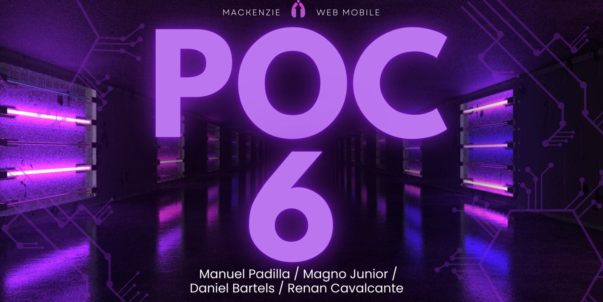
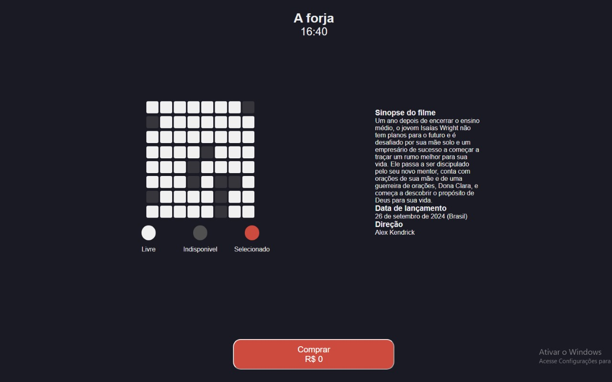
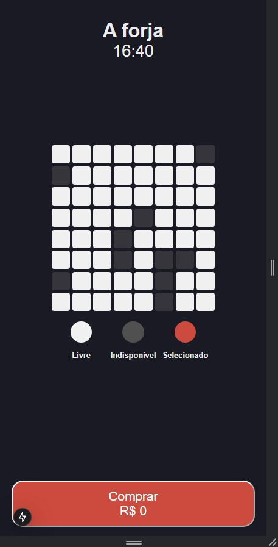

# POC-06-a forja
 

## Nessa prova conceito iremos explicar como criamos um site que simula a compra de ingressos do filme "A Forja".




PAra criar todo projeto usamos o react e foi criado components nele , listando eles tem:

## sinopse
 Aqui tem toda a parte de sinopse do trabalho em componente , nas pasta tem sinpose.js ( implementação do javascript em react ) e o sinopse.css ( toda parte de estilização)
 
### JSX 

```
"use client";  // Esta linha é usada em Next.js para indicar que o código abaixo será executado no lado do cliente
import Link from 'next/link';  // O Link é importado do Next.js para criar links de navegação entre as páginas sem recarregar a página completamente
import styles from './Sinopse.module.css';  // Importação dos estilos para o componente

export default function Sinopse() {
    return (
        <div className={styles.containerSinopse}>
            <div className={styles.sinopse}>
                <h3>Sinopse do filme</h3>
            </div>
        </div>
    );
}
```


### css

```css
.containerSinopse {
  width: 50%;
  height: 70%;
  display: flex;
  justify-content: space-evenly;
}

.sinopse {
    width: 300px;
    padding: 20px;
    border-radius: 8px;
  }

@media (max-width: 600px) {   
    .sinopse {
      display: flex;
      flex-direction: column;
    }
}
```


## Sala 
 A parte de criação de uma interface visual para uma sala de  , 8 linhas de assentos usando o componente Fila e Um bloco de tela para representar a tela do cinema ou teatro com Uma legenda que descreve o significado de diferentes cores para os assentos (livre, indisponível, selecionado).

 explicando o codigo em parte temos a parte de toggleSeat, que é a função usada para alternar o estado de um assento, como "selecionado" ou "indisponível". Essa função é passada para o componente Fila.
 ```jsx
<div className={styles.container_filas}>
    <Fila toggleSeat={toggleSeat} />
    <Fila toggleSeat={toggleSeat} />
    <Fila toggleSeat={toggleSeat} />
    <Fila toggleSeat={toggleSeat} />
    <Fila toggleSeat={toggleSeat} />
    <Fila toggleSeat={toggleSeat} />
    <Fila toggleSeat={toggleSeat} />
    <Fila toggleSeat={toggleSeat} />
</div>
```
#### continuação
```jasx
 // representando da tela do cinema e está dentro de um div com a classe Tela para estilizar sua aparência 
<div className={styles.Tela}>  
            <p>Tela</p>
        </div>

        // aqui a parte da tela tambem  fica com uma div chamada AcentoCinzaTela , para estilização mais detalhada
        <div className={styles.BlocoTela}>
            <div className={styles.AcentoCinzaTela}>
                </div>
        </div><br></br><br></br>
```
        
        
        ``` jsx
            <div className={styles.legenda}>
                <div className={styles.status}>
                    <div className={styles.AcentoBrancoBOLINHA}></div>  //Livre: Representado por um círculo branco (AcentoBrancoBOLINHA).
                    <p>Livre</p>
                </div>
                <div className={styles.status}>
                    <div className={styles.AcentoCinzaBOLINHA}></div>  //Indisponível: Representado por um círculo cinza (AcentoCinzaBOLINHA).
                    <p>Indisponivel</p>
                </div>
                <div className={styles.status}>
                    <div className={styles.AcentoVermelhoBOLINHA}>  //Selecionado: Representado por um círculo vermelho (AcentoVermelhoBOLINHA).
                    <p>Selecionado</p>
                </div>
            </div>
        </div>
    ); 
    ```


Os  Assento Livre Representa por um círculo branco (AcentoBrancoBOLINHA).
Já o Indisponível Representado por um círculo cinza (AcentoCinzaBOLINHA).
E os Selecionado Representa por um círculo vermelho (AcentoVermelhoBOLINHA).

### css
```CSS
.container_filas {
    width: 70%;
    height: 70%;
    display: flex;
    flex-direction: column;
}
```
Aqui usa o flexbox para estilizar melhor para uma coluna e organiza os itens filhos (as filas) de forma vertical (de cima para baixo).

no css tem a estilização da tela e o do "bloco da tela" , da criação dos assentos e seus formatos e cores , junto com tudo vamos ter o css aplica na legenda ( livre , selecionado e desocupado )

## fila 
Ele renderiza uma fila de 8 assentos (representados como branco ou cinza) , que quando o componente é montado, os assentos são randomizados.
O estado dos assentos é gerenciado no useState, e o useEffect garante que a randomização aconteça apenas na primeira renderização e quando um assento é clicado, a função toggleSeat (passada como prop) é chamada para lidar com a interação.

```jsx
// Definição do Componente Fila
export default function Fila(props) {
    const { toggleSeat } = props;

    // Definição dos Elementos de Assentos
    const branco = <div className={styles.AcentoBranco} onClick={(e) => toggleSeat(e.target)}></div>;
    const cinza = <div className={`${styles.AcentoCinza} ${styles.unavailable}`} onClick={(e) => toggleSeat(e.target)}></div>;

     //Estado de Assentos
     //assentos: Um estado que armazena os assentos da fila.
     //setAssentos: A função usada para atualizar o estado dos assentos.
const [assentos, setAssentos] = useState([]);
```

```jsx
// Função para Randomizar Assentos
function randomizarAssento() {
    let novosAssentos = [];
    for (let i = 0; i < 8; i++) {
        const num = Math.floor(Math.random() * 5);
        if (num === 0) {
            novosAssentos.push(cinza);
        } else {
            novosAssentos.push(branco);
        }
    }
    setAssentos(novosAssentos); 
}

useEffect(() => { // Efeito de Montagem
    randomizarAssento();
}, []);
```

### continuação 
 O assentos.map(...): O método map é utilizado para iterar sobre o array de assentos e renderizar cada assento (branco ou cinza) dentro de uma div. Cada assento tem uma chave única (key={index}) para ajudar o React a identificar os elementos de forma eficiente.

```jsx
return (
    <div className={styles.Fileira}>
        {assentos.map((assento, index) => (
            <div key={index}>
                {assento}
            </div>
        ))}
    </div>
);
```


 ### Css
No css é importante destacar o flexbox que o ".conteiner" vai exibir os itens verticalmente , ele tamebém Garante que os itens dentro dele fiquem distribuídos igualmente ao longo do eixo vertical, com espaços iguais entre eles e alinhar os itens ao centro horizontalmente 

```css

.container {
  display: flex;
  flex-direction: column;
  justify-content: space-evenly;
  align-items: center;
  width: 60vw;
}
```

## button 
 aqui é um simples botão de compra que, ao ser clicado, exibe um alerta confirmando a compra e mostra o preço total da compra
 Quando o valor total da compra (passado como totalPrice) for 100.00, o botão exibirá:O texto "Comprar" (dentro da tag <p className={styles.Comprar}>).
 O preço da compra será exibido como R$ 100.00 (dentro da tag <p className={styles.Preco}>).
 Quando o usuário clica no botão, um alerta com a mensagem "Compra realizada com sucesso!" será exibido. 
 ```

//Botao é uma função que recebe as propriedades (props) do seu componente pai
//Ele extrai a propriedade totalPrice (preço total) para ser exibido no botão.
export default function Botao(props) {
    const { totalPrice } = props;  // totalPrice é uma variável que representa o preço total de uma compra. Esse valor será mostrado ao usuário no botão.

    return (
        <div className={styles.botao}>
            <button id="buyButton" onClick={() => {
                alert(`Compra realizada com sucesso!`);
            }}>
                <p className={styles.Comprar}>Comprar</p>
                <p id="preco" className={styles.Preco}>
                    R$ {totalPrice}
                </p>
            </button>
        </div>
    );
}
```

### css 
 a estilização é bem simples mas tem algo importante a ressaltar 
justify-content: space-evenly;: Isso distribui o espaço de maneira uniforme entre os elementos filhos dentro de .botao.
Se houver múltiplos elementos (como textos ou botões dentro da .botao), eles serão espaçados igualmente.
 ```css
.botao {
  display: flex;
  justify-content: space-evenly;
  text-align: center;
}

.botao button {
  background-color: #CD4A3E;
  border-radius: 19px;
  font-family: 'Arial', sans-serif;
  width: 400px;
  height: 76px;
}

.Comprar,
.Preco {
  font-size: 1.3rem;
}
```

### Esses foram os component s criado , agora tem os principais 


# page.js
Nele tem muitos recursos importantes e principais do projeto como :


### Função toggleSeat
Para Controlar a seleção de assentos.

``` jsx

function toggleSeat(element) { // Se o assento estiver marcado como indisponível a função retorna e não faz nada.
  if (element.classList.contains(filaStyles.unavailable)) {
    return;
  }

  // mas caso ao contrário tem duas opções :
  element.classList.toggle(filaStyles.AcentoBranco); // assento disponível 
  element.classList.toggle(filaStyles.AcentoVermelho); // assento selecionado 

  if (element.classList.contains(filaStyles.AcentoVermelho)) {
    selectedSeats++;
  } else {
    selectedSeats--; // Aqui a contagem de assentos selecionados é aumentada ou diminuída conforme a seleção do assento.
  }

  updatePrice(); // no final Após isso, chama-se esta função para recalcular o preço total.
}
```

### Função updatePrice
Atualizar o preço total.
resumindo O preço total (totalPrice) é calculado com base no preço base (basePrice), no número de assentos selecionados (selectedSeats), e no preço por assento (seatPrice).

```jsx
 function updatePrice() {
  totalPrice = basePrice + selectedSeats * seatPrice;
  console.log(totalPrice);
  document.getElementById('preco').innerHTML = `R$ ${totalPrice.toFixed(2)}`; /// O valor é formatado para duas casas decimais e atualizado no elemento HTML 
}


### Função applyColorScheme() ( modo dark e light)
Quando o esquema de cores do sistema for alterado (por exemplo, o usuário mudar para o modo escuro ou claro), a função applyColorScheme será chamada para atualizar a página com o novo esquema.
```jsx
function applyColorScheme() {
// Aki detecta o esquema de cores preferido pelo usuário. Se o valor for true, significa que o usuário prefere o modo escuro.
if (window.matchMedia && window.matchMedia('(prefers-color-scheme: dark)').matches) { 
    document.body.classList.add(styles.dark);
    document.body.classList.remove(styles.light);

  //Caso o usuário prefira o modo claro (ou caso não seja especificado um esquema de cores), o código adiciona a classe light e remove a classe dark, aplicando o tema claro.
 } else {
    document.body.classList.add(styles.light);
    document.body.classList.remove(styles.dark);
  }
}
// ja aqui Monitorar mudanças no esquema de cores preferido pelo usuário, para que o tema seja atualizado dinamicamente, caso o usuário altere as configurações de tema no sistema.
if (window.matchMedia) {
  window.matchMedia('(prefers-color-scheme: dark)').addEventListener('change', applyColorScheme);
  window.matchMedia('(prefers-color-scheme: light)').addEventListener('change', applyColorScheme);
}

applyColorScheme() // aplica tudo 
```

### Retorno

```jsx 
return (
  <div className={styles.container}> // O layout vai ser usado estruturado aqui 
    <header className={styles.Titulo}>
      <div className={styles.tituloAForja}>
        <h1>A forja</h1>
      </div>
      <div className={styles.Hora}>
        <p>16:40</p>
      </div>
    </header>
    <main className={styles.main}> // A área principal do conteúdo é dividida em duas partes
      <div className={styles.sala}>
        <Sala toggleSeat={toggleSeat} /> // primeira parte é a sala de cinema (onde os assentos são exibidos)
      </div>
      <Sinopse /> // segunda parte é a sinopse
    </main>
    <Botao totalPrice={totalPrice} /> // E aqui exibe o preço total de acordo com os assentos selecionados.
  </div>
```

# globals.css
 
### Variáveis de Cores:

```css
:root { // seletor é utilizado para definir variáveis CSS que podem ser usadas em qualquer parte do documento  aqui define as cores de fundo  
  --background: #ffffff; // fundo branco
  --foreground: #171717; // texto escuro
}
```

### Propriedades para o body
```css 
  body {
  display: flex;
  color: var(--foreground); // Aplica a cor do texto de acordo com a variável --foreground
  background: var(--background); // 
  font-family: Arial, Helvetica, sans-serif;
  -webkit-font-smoothing: antialiased;
  -moz-osx-font-smoothing: grayscale;
  width: 100%;
  margin: 0 auto;
  padding: 10px;
  height: 100vh;
  overflow: hidden; //  Impede que a rolagem vertical apareça no body.
  justify-content: center;
}
```
### Estilos Globais " * " e estilos para links " a " 

```css
* {
  box-sizing: border-box;
  padding: 0;
  margin: 0;
}

a {
  color: inherit; // Faz com que os links herdem a cor do texto da sua área pai, o que significa que a cor dos links será a mesma definida pela variável --foreground.
  text-decoration: none;
}
```

# page.module.css

### Estilizando o .tituloAForja e .Hora E TAMBÉM Estilos específicos para HORA

```css
.tituloAForja,
.Hora { //  centraliza os dois no centro
  text-align: center;
}

.Hora { // esse é a estilizaçõa so pra ele 
  font-family: 'Arial';
  font-size: 27px;
}
```

### flexbox
 O container é o contêiner principal que vai conter os elementos filhos (título, horário, conteúdo da sala, etc.).

 ```css
.container {
  display: flex;
  flex-direction: column; // organiza os itens de forma vertical (em uma coluna).
  justify-content: space-evenly; // distribui os elementos filhos de forma equidistante ao longo do eixo principal (neste caso, o eixo vertical).
  align-items: center; // alinha os itens ao centro do contêiner, no eixo transversal (horizontal).
  width: 60vw;
}
```
### main e sala 
 A .main é o contêiner que organiza o conteúdo principal, como a área da sala e talvez outros componentes (como sinopse ou botões).
 já .sala representa uma área de visualização, como um painel de assentos ou um componente específico dentro da página. 

 ``` 
 .main {
  display: flex;
  align-items: center;
  justify-content: space-between; // distribui os itens de forma que fiquem alinhados nas extremidades da .main, com espaço igual entre eles.
  width: 100%;
  height: 70%;
}
.sala {
  width: 50%;
  height: 100%;
  display: flex;
  justify-content: center; // alinha os itens da .sala horizontalmente no centro.
  align-items: center;
}
```

## Media query 
em resumo ; Essas media queries são usadas para ajustar o layout do site para diferentes tamanhos de tela e preferências de esquema de cores.

Em telas pequenas (até 600px): Os elementos são rearranjados verticalmente e têm seus tamanhos ajustados (como largura e altura).
Em telas médias (até 768px): A altura e largura dos componentes são ajustadas para ocupar a tela inteira em dispositivos como tablets.
Preferência de cor escura (dark mode): O site pode detectar se o usuário prefere um esquema de cores escuro e adaptar a interface para isso.

```css
//fila.modules .css
@media (max-width: 600px) {
  .container {
    flex-direction: column; /* Alinha verticalmente os elementos */
    align-items: center;
  }

  .sinopse {
    margin-top: 16px; /* Espaçamento acima da sinopse */
    width: 90%; /* Largura ajustada para telas menores */
  }

  .sala {
    width: 100%; /* Garante que a sala ocupe toda a largura */
  }
}

//sala.module.css
@media (max-width: 600px) {
    .container_filas {
        display: flex;
        flex-direction: column;Alinha os itens dentro de verticalmente
        width: 100%;
    }

    .status {
        font-size: 0.8rem;
        font-weight: bold;
    }

    .legenda {
        width: 100%;
    }

    .AcentoBrancoBOLINHA,
    .AcentoCinzaBOLINHA,
    .AcentoVermelhoBOLINHA {
        width: 45%;
        height: 40%;
        margin: 2px;
        border-radius: 40px;
    }
}

//globals.css
@media (prefers-color-scheme: dark) {
  html {
    color-scheme: dark;
  }
}

// page .module.css
@media (max-width: 768px) {
  .container {
    height: 100vh;
  }

  .sala {
    width: 100%;
    height: 100%;
  }
}
```




